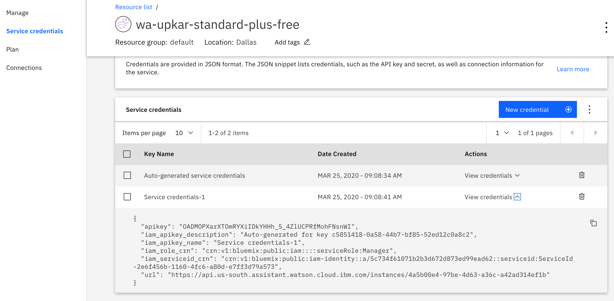

This tutorial takes you through building a simple Node.js application that is connected to a COVID-19 chatbot using the Watson Assistant APIs. The steps are taken from this [assistant-simple repository](https://github.com/watson-developer-cloud/assistant-simple) and adopted for 2020 Call for Code challenge. You can use this tutorial as a starting template for the [COVID-19 challenge](https://developer.ibm.com/callforcode/getstarted/covid-19/).

## Learning objectives

In this tutorial, you will:

1. Learn how to create a simple Node.js application.
2. Connect the application to a chatbot using the IBM Watson Assistant APIs.
3. Test and run the application locally.
4. Deploy the application on IBM Cloud as a Cloud Foundry application.

Here is a demo of the final application:


## Prerequisites

1. Sign up for an [IBM Cloud account](https://www.ibm.com/account/reg/us-en/signup?formid=urx-42793&eventid=cfc-2020?cm_mmc=OSocial_Blog-_-Audience+Developer_Developer+Conversation-_-WW_WW-_-cfc-2020-ghub-starterkit-communication_ov75914&cm_mmca1=000039JL&cm_mmca2=10008917).
1. Download the [IBM Cloud CLI](https://cloud.ibm.com/docs/cli/index.html#overview). You will use it to push your Node.js application to the cloud.
1. You should already have a Watson Assistant service created when you deployed the COVID bot. You need to get the credentials from that chatbot to use in your Node.js application:
    - Log in to your IBM Cloud account.
    - Go to resources and open your Watson Assistant service instance.
    - You will be taken to Watson Assistant launch page. Click **Service Credentials** to view the service credentials.
      
    - You will use these credentials to populate the `.env` file when configuring the application below. Copy and save the JSON somewhere or leave this window open.

## Estimated **time**

This tutorial will take you about 30 minutes to complete.

## Steps

The following steps assume that you have created an assistant, imported the COVID skills, and have the Watson Assistant service credentials available.

## Configuring the application

1. Clone the repository and cd into `starter-kit/covid-simple`.

2. Copy the *.env.example* file to a file called *.env*

    ```
    cp .env.example .env
    ```

3. Open the *.env* file and add the service credentials that you obtained in the previous step. 

    The following example *.env* file configures the `apikey` and `url` for a Watson Assistant service instance hosted in the US East region:

    ```
    ASSISTANT_IAM_APIKEY=X4rbi8vwZmKpXfowaS3GAsA7vdy17Qhxxxxxxxx
    ASSISTANT_URL=https://gateway-wdc.watsonplatform.net/assistant/api
    ```

    - If your service instance uses `username` and `password` credentials, add the `ASSISTANT_USERNAME` and `ASSISTANT_PASSWORD` variables to the *.env* file.

    The following example *.env* file configures the `username`, `password`, and `url` for a Watson Assistant service instance hosted in the US South region:

    ```
    ASSISTANT_USERNAME=522be-7b41-ab44-dec3-xxxxxxxx
    ASSISTANT_PASSWORD=A4Z5BdGENxxxx
    ASSISTANT_URL=https://gateway.watsonplatform.net/assistant/api
    ```
    
    However, if your credentials contain an IAM API key, copy the `apikey` and `url` to the relevant fields.
    
    ```JSON
      {
        "apikey": "ca2905e6-7b5d-4408-9192-xxxxxxxx",
        "iam_apikey_description": "Auto generated apikey during resource-key ...",
        "iam_apikey_name": "auto-generated-apikey-62b71334-3ae3-4609-xxxxxxxx",
        "iam_role_crn": "crn:v1:bluemix:public:iam::::serviceRole:Manager",
        "iam_serviceid_crn": "crn:v1:bluemix:public:iam...",
        "url": "https://gateway-syd.watsonplatform.net/assistant/api"
      }
    ```
   
   ```
    ASSISTANT_IAM_APIKEY=ca2905e6-7b5d-4408-9192-xxxxxxxx
    ```

4. Add the `ASSISTANT_ID` to the previous properties:

    ```
    ASSISTANT_ID=522be-7b41-ab44-dec3-xxxxxxxx
    ```

## Running locally

1. Install the dependencies:

    ```
    npm install
    ```

1. Run the application:

    ```
    npm start
    ```

1. View the application in a browser at `localhost:3000`.

## Deploy to IBM Cloud as a Cloud Foundry application

1. Log in to IBM Cloud with the [IBM Cloud CLI](https://cloud.ibm.com/docs/cli/index.html#overview):

    ```
    ibmcloud login
    ```

1. Target a Cloud Foundry organization and space:

    ```
    ibmcloud target --cf
    ```

1. Edit the *manifest.yml* file. Change the **name** field to something unique.  
  For example, `- name: covid-assistant-simple-yourname`.

1. Deploy the application

    ```
    ibmcloud app push
    ```

1. View the application online at the app URL. For example, [covid-assistant-simple-yourname.mybluemix.net](covid-assistant-simple-yourname.mybluemix.net).

## Take on COVID-19

You now know how to build a chatbot using Watson Assistant and a website on IBM Cloud that users to interact with the chatbot. You can see some other Watson Assistant sample applications in the [official documentation](https://cloud.ibm.com/docs/services/assistant?topic=assistant-sample-apps). 

It's your turn to use these technologies to help tackle this pandemic and make a difference by accepting the [COVID-19 challenge](https://developer.ibm.com/callforcode/getstarted/covid-19/)!
