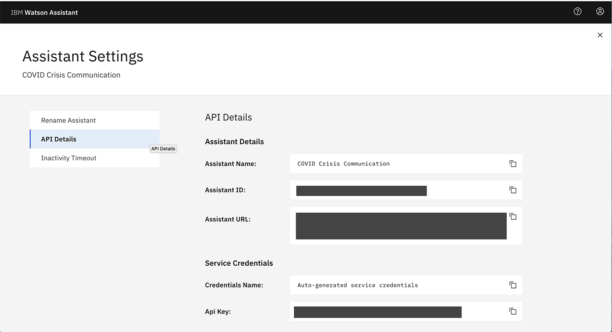

This tutorial takes you through building a simple Node.js application that is connected to a COVID-19 chatbot using the Watson Assistant APIs. The steps are taken from this [assistant-simple repository](https://github.com/watson-developer-cloud/assistant-simple) and adopted for 2020 Call for Code challenge. You can use this tutorial as a starting template for the [COVID-19 challenge](https://developer.ibm.com/callforcode/getstarted/covid-19/).

## Learning objectives

In this tutorial, you will:

1. Learn how to create a simple Node.js application.
2. Connect the application to a chatbot using the IBM Watson Assistant APIs.
3. Test and run the application locally.
4. Deploy the application on IBM Cloud as a Cloud Foundry application.

Here is a demo of the final application:


## Prerequisites

1. Sign up for an [IBM Cloud account](https://www.ibm.com/account/reg/us-en/signup?formid=urx-42793&eventid=cfc-2020?cm_mmc=OSocial_Blog-_-Audience+Developer_Developer+Conversation-_-WW_WW-_-cfc-2020-ghub-starterkit-communication_ov75914&cm_mmca1=000039JL&cm_mmca2=10008917).
1. Download the [IBM Cloud CLI](https://cloud.ibm.com/docs/cli/index.html#overview). You will use it to push your Node.js application to the cloud.
1. You should already have a Watson Assistant service created when you deployed the COVID bot [following this tutorial](https://developer.ibm.com/tutorials/crisis-communication-chatbot-watson-assistant-webhook-integration-discovery-covid-data/). You will need your assistant credentials (Assistant ID, Assistant URL and Api Key) as explained in the previous tutorial.

    

## Estimated **time**

This tutorial will take you about 30 minutes to complete.

## Steps

The following steps assume that you have created an assistant, imported the COVID skills, and have the assistant credentials available.

## Configuring the application

1. Clone the repository and cd into `starter-kit/covid-simple`.

2. Copy the *.env.example* file to a file called *.env*

    ```
    cp .env.example .env
    ```

3. Open the *.env* file and change the credentials as follows:

    - ASSISTANT_URL: service endpoint for Watson Assistant based on the region your service is created in. You can get the region specific service endpoints from the [documentation](https://cloud.ibm.com/apidocs/assistant/assistant-v2). The URLs are as follows at the time these instructions were written:
    |Region|Service Endpoint|
    |------|----------------|
    |Dallas|https://api.us-south.assistant.watson.cloud.ibm.com|
    |Washington, DC|https://api.us-east.assistant.watson.cloud.ibm.com|
    |Frankfurt|https://api.eu-de.assistant.watson.cloud.ibm.com|
    |Sydney|https://api.au-syd.assistant.watson.cloud.ibm.com|
    |Tokyo|https://api.jp-tok.assistant.watson.cloud.ibm.com|
    |London|https://api.eu-gb.assistant.watson.cloud.ibm.com|
    - ASSISTANT_ID: `Assistant ID` as shown in the screenshot above.
    - ASSISTANT_IAM_APIKEY: `Api Key` as shown in the screenshot above.
    - ASSISTANT_IAM_URL: `Assistant URL` as shown in the screenshot above.

    That's it! You are now ready to run your application. 

    **_Note_**: if you have an older Watson Assistant Service, you may have to use a username and password in place of the API key. The following example *.env* file configures the `username`, `password`, and `url` for an older Watson Assistant service instance hosted in the US South region:

    ```
    ASSISTANT_USERNAME=522be-7b41-ab44-dec3-xxxxxxxx
    ASSISTANT_PASSWORD=A4Z5BdGENxxxx
    ASSISTANT_URL=https://gateway.watsonplatform.net/assistant/api
    ```

## Running locally

1. Install the dependencies:

    ```
    npm install
    ```

1. Run the application:

    ```
    npm start
    ```

1. View the application in a browser at `localhost:3000`.

## Deploy to IBM Cloud as a Cloud Foundry application

1. Log in to IBM Cloud with the [IBM Cloud CLI](https://cloud.ibm.com/docs/cli/index.html#overview):

    ```
    ibmcloud login
    ```

1. Target a Cloud Foundry organization and space:

    ```
    ibmcloud target --cf
    ```

1. Edit the *manifest.yml* file. Change the **name** field to something unique.  
  For example, `- name: covid-assistant-simple-yourname`.

1. Deploy the application

    ```
    ibmcloud app push
    ```

1. View the application online at the app URL. For example, [covid-assistant-simple-yourname.mybluemix.net](covid-assistant-simple-yourname.mybluemix.net).

## Build a Docker container

If you want to containerize this covid-assistant-simple application so that you can run it in a
Kubernetes cluster or other hosted service, follow these instructions.

- First, fill in the Watson Assistant credentials in the .env file.
- The slim version of package.json strips out the test dependencies and will be copied into the container.
- Build the container:

 ```docker build . -t <your-docker-username>/covid-chatbot```

- Test your container interactively

 ```docker container run -p 3000:3000 --name chatbot -it <your-docker-username>/covid-chatbot:latest /bin/bash```
- Within the container, run

 ```node server.js```
- Open a browser to http://localhost:3000
- Exit the container
- Optionally, push the container to Docker Hub (remember that it has your credentials file so you might want to push it to a private repository or registry)


## Take on COVID-19

You now know how to build a chatbot using Watson Assistant and a website on IBM Cloud that users to interact with the chatbot. You can see some other Watson Assistant sample applications in the [official documentation](https://cloud.ibm.com/docs/services/assistant?topic=assistant-sample-apps).

It's your turn to use these technologies to help tackle this pandemic and make a difference by accepting the [COVID-19 challenge](https://developer.ibm.com/callforcode/getstarted/covid-19/)!
