###

Learn how to create a voice-enabled chatbot using Node-RED and the IBM Watson Assistant, Watson Speech to Text, and Watson Text to Speech services.

## Learning objectives

In this tutorial, you will:

- Learn about Node-RED and see how to install it locally and on IBM Cloud
- Explore the node-red-node-watson Node-RED nodes
- Import and deploy the Watson Assistant chatbot example
- Build a Call for Code COVID Crisis Communications voice-enabled chatbot solution

## Prerequisites

- Install Node-RED [locally](https://nodered.org/docs/getting-started/) or [Create a Node-RED Starter application](https://developer.ibm.com/components/node-red/tutorials/how-to-create-a-node-red-starter-application/) in IBM Cloud
    - After Node-RED is installed, add the dependencies:

    ```
    npm install node-red-contrib-browser-utils node-red-dashboard node-red-node-watson node-red-contrib-play-audio
    ```
 - Create a Watson Assistant COVID-19 crisis communications chatbot.

## Estimated time

Completing this tutorial should take about 30 minutes.

## Architecture diagram

### Voice enabled COVID Crisis Communications Chatbot using Node-RED

The following diagram shows the workflow for a Node-RED chatbot that answers questions about COVID-19.


1. A user visits a voice enabled Node-RED website with the COVID-19 chatbot and asks a question.
2. Node-RED records the speech wav file and calls the Watson Speech to Text service hosted in IBM Cloud.
3. Watson Speech to Text uses machine learning to decode the user's speech.
4. Watson Speech to Text replies with a transcript of the COVID-19 question and Node-RED calls Watson Assistant service hosted in IBM Cloud.
5. Watson Assistant uses natural language understanding and machine learning to extract entities and intents of the user question.
6. Source COVID-19 FAQ information from trusted CDC data.
7. Watson Assistant invokes an OpenWhisk open source-powered IBM Cloud Function.
8. IBM Cloud Function calls Watson Discovery service running in IBM Cloud.
9. Watson Discovery scans news articles and responds with relevant articles.
10. Watson Assistant invokes an OpenWhisk open source-powered IBM Cloud Function.
11. IBM Cloud Function calls COVID-19 API to get statistics.
12. Watson Assistant replies to the user inquiry and Node-RED sends the text transcript to Watson Text to Speech.
13. Watson Text to Speech encodes the message in the user's language.
14. Node-RED plays the chat answer .wav file to the user.
15. The user listens to the chat answer.

## Steps

### Learn about Node-RED

[Node-RED](http://nodered.org) is an open source programming tool for wiring together hardware devices, APIs, and online services in new and interesting ways. It provides a browser-based editor that makes it easy to wire together flows using the wide range of nodes in the palette that can be deployed to its runtime in a single-click.

### Install Node-RED Dependencies nodes

After Node-RED is installed, add the dependencies for this tutorial:

- [node-red-contrib-browser-utils](https://flows.nodered.org/node/node-red-contrib-browser-utils)
- [node-red-dashboard](https://flows.nodered.org/node/node-red-dashboard)
- [node-red-node-watson](https://flows.nodered.org/node/node-red-node-watson)
- [node-red-contrib-play-audio](https://flows.nodered.org/node/node-red-contrib-play-audio)

```
npm install node-red-contrib-browser-utils node-red-dashboard node-red-node-watson node-red-contrib-play-audio
```

### Explore node-red-node-watson Node-RED nodes

The [node-red-node-watson GitHub repository](https://github.com/watson-developer-cloud/node-red-node-watson) includes a collection of Node-RED nodes for IBM Watson services.  This package adds the following nodes to your Node-RED palette:

- Assistant: Add conversational capabilities into applications
- Discovery: List environments created for Watson Discovery
- Language Identification: Detect the language used in text
- Language Translator: Translate text from one language to another
- Natural Language Classifier: Use machine learning algorithms to return the top matching predefined classes for short text inputs
- Natural Language Understanding: Analyze text to extract meta-data from content such as concepts, entities, and keywords
- Personality Insights: Use linguistic analytics to infer cognitive and social characteristics from text
- Speech To Text: Convert audio containing speech to text
- Text To Speech: Convert text to audio speech
- Tone Analyzer: Discover, understand, and revise the language tones in text
- Visual Recognition: Analyze visual appearance of images to understand their contents

### Import and deploy the COVID-19 crisis communication chatbot example

Now that you have installed the Node-RED dependencies, Watson nodes are available to integrate Watson AI services. Let's build a voice enabled chatbot example that uses Watson Assistant, Watson Speech to Text and Watson Text to Speech.

Import this [flow](/starter-kit/node-red/flows/Node-RED-Voice-Enabled-Chatbot.json) and **Deploy** the flow.

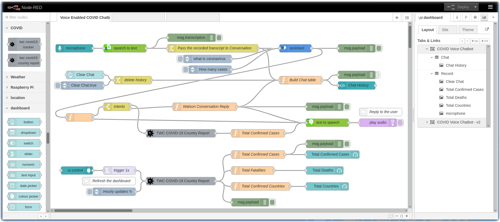

### Create Watson Services on IBM Cloud

Before the flow will execute successfully, you must configure the Watson Assistant and Watson Speech nodes with new service instances and API Keys.

#### Create a Watson Assistant instance

1. If you haven't already, create a [Watson Assistant service instance](https://cloud.ibm.com/catalog/services/watson-assistant).

 

1. Follow these [instructions](/README.md) to provision a Watson Assistant chatbot for COVID-19

#### Create a Watson Speech to Text service instance

1. Create a [Watson Speech to Text Service instance](https://cloud.ibm.com/catalog/services/speech-to-text) instance from the IBM Cloud Catalog. Click **Create**.

 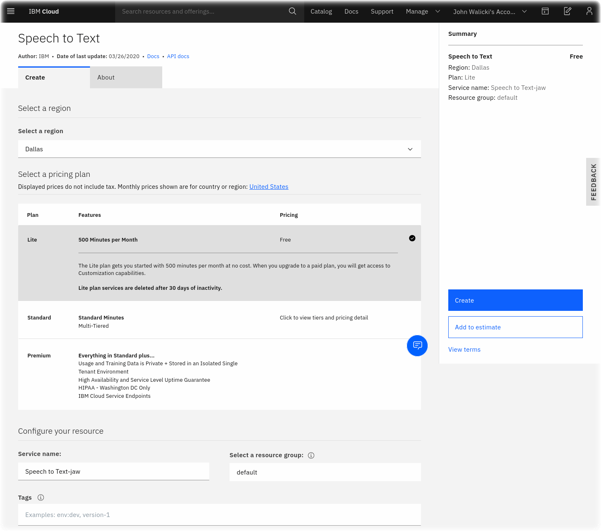

 The Node-RED Watson Speech to Text node will need the `apikey` credentials for this new instance.
2. Once the Watson Speech to Text service has been created, click **Service credentials** (1).
3. Click the **View credentials** (2) twistie.
4. Copy the **apikey** (3) for use in the next section

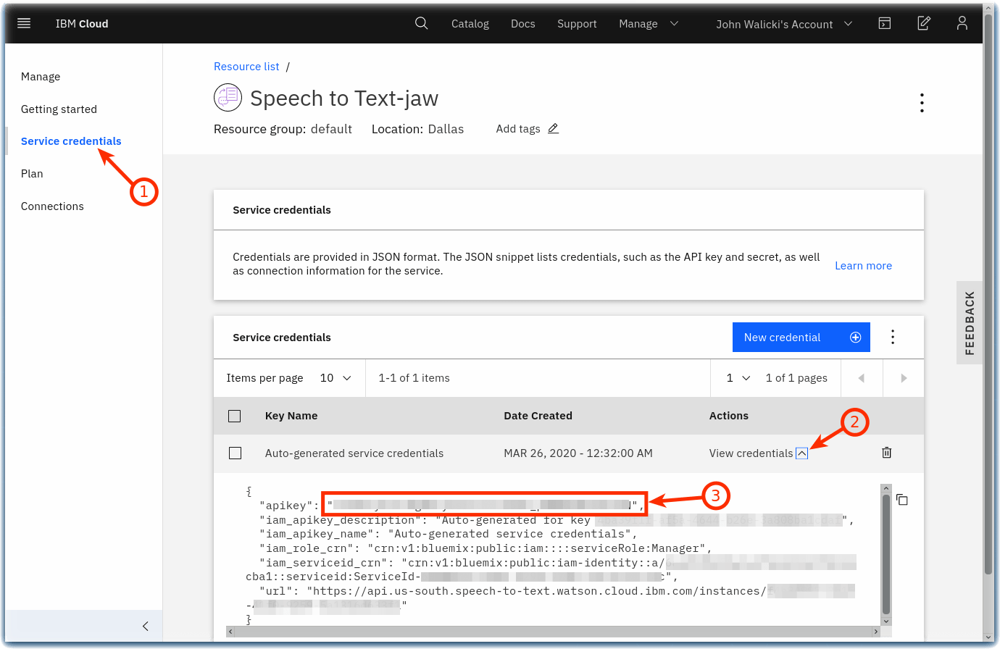  

#### Create a Watson Text to Speech service instance

Create a [Watson Text to Speech Service](https://cloud.ibm.com/catalog/services/text-to-speech) instance from the IBM Cloud Catalog.

1. Click **Create**.
 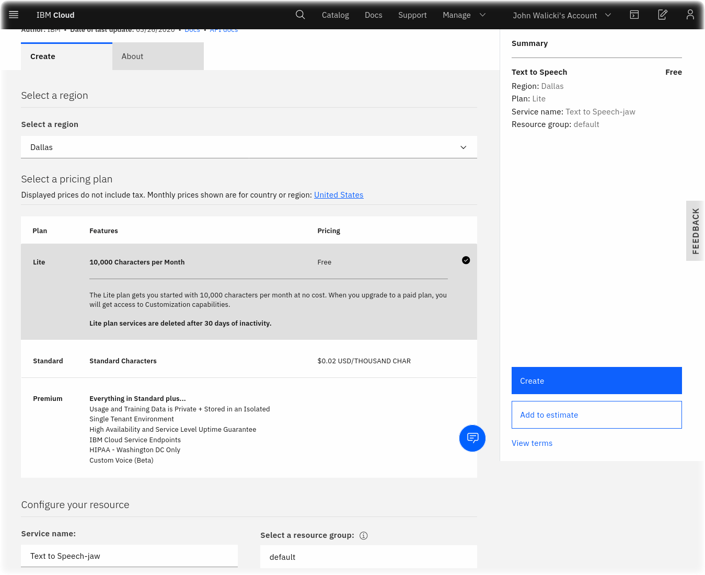

 The Node-RED Watson Text to Speech node will need the apikey credentials for this new instance
2. After you create the Watson Text to Speech service, click **Service credentials** (1).
3. Click the **View credentials** (2) twistie.
4. Copy the **apikey** (3) for use in the next section.
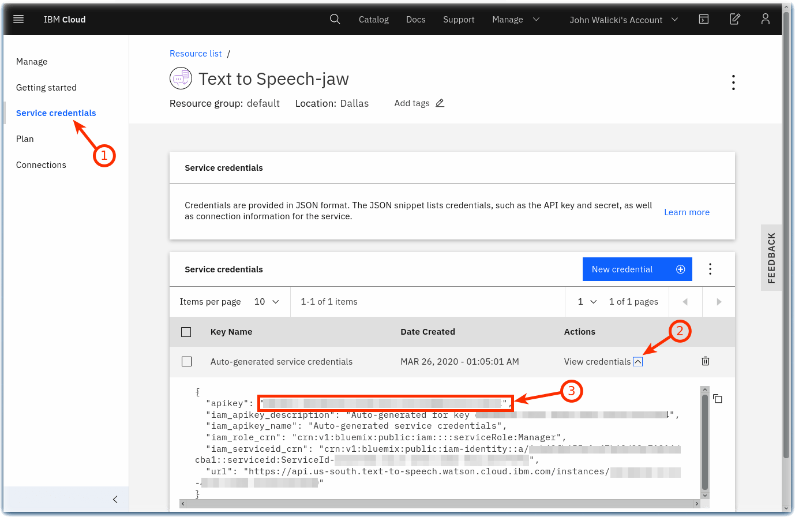  

### Enable Watson Speech Nodes with API keys

1. Double click on the **speech to text** node and paste the API key from the Watson Speech to Text service instance
2. Click **Done**.

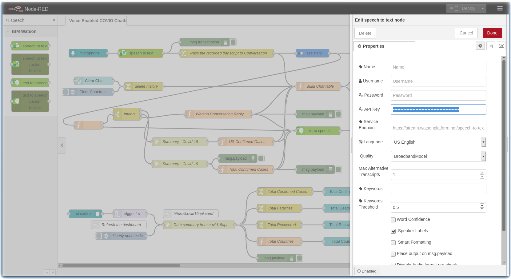

3. Double-click the **text to speech** node and paste the API key from the Watson Text to Speech service instance.
4. Click **Done**.
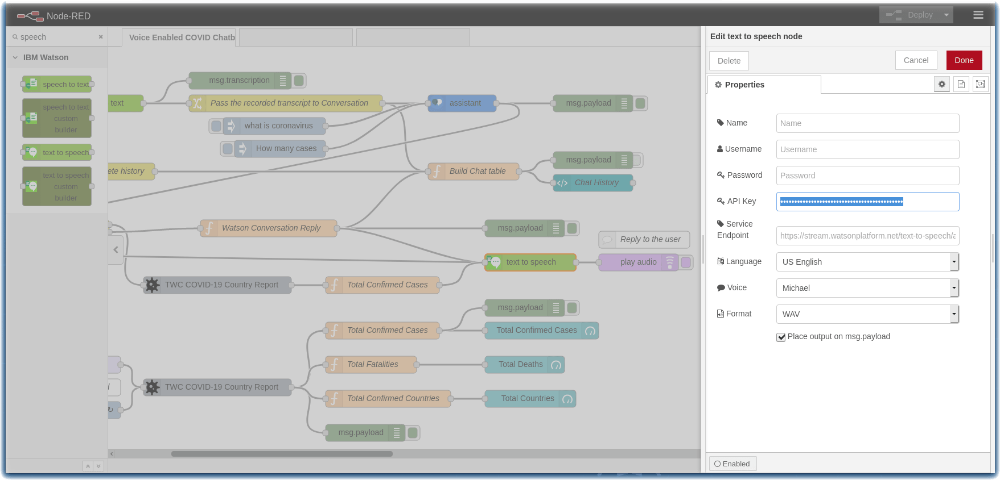

### Enable Watson Assistant node with the COVID-19 Workspace ID and API Key

1. Double-click the **assistant** node and paste the Skill ID into the Workspace ID field, Assistant Service Endpoint URL, and the API key from the Watson Assistant service instance.

2. Click **Done**.

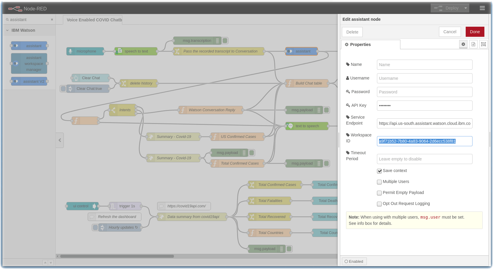

### Parse intents and invoke API calls

Watson Assistant returns the intents related to your questions.

- The `Switch` node routes two intents to an `http request` node to query an external data source for current COVID statistics.
- A `Function` node adds up the summary statistics and builds a sentence to be spoken.

### Deploy the Node-RED flows

- Click on the Red **Deploy** button,

### Talk to your COVID-19 crisis chatbot

To talk to your chatbot, click on the **microphone** input tab and ask a question about COVID.

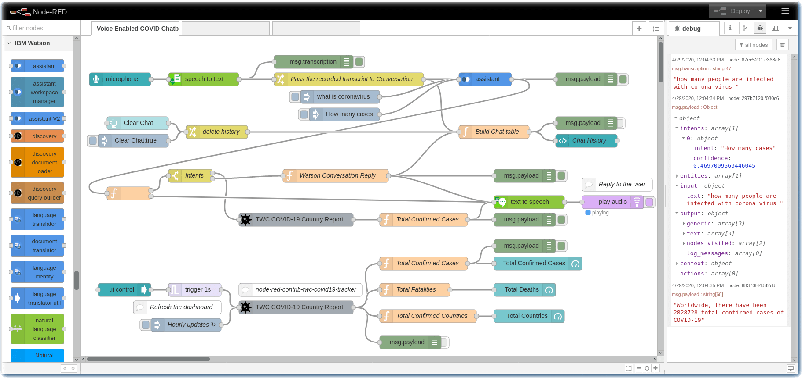

### Build a Node-RED COVID Statistics Dashboard

**Bonus**: This flow includes a Node-RED Dashboard with several gauges to display COVID-19 statistics.

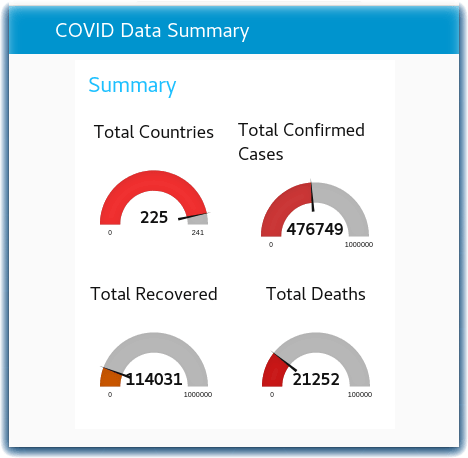

- Every hour the Node-RED flow will call the [covid19api](https://api.covid19api.com/summary) summary API and collect dynamic COVID-19 infection statistics
- The country data is aggregated and then the gauges are updated

### Learn more about the Dashboard code

The following Node-RED flow is included in this tutorial.

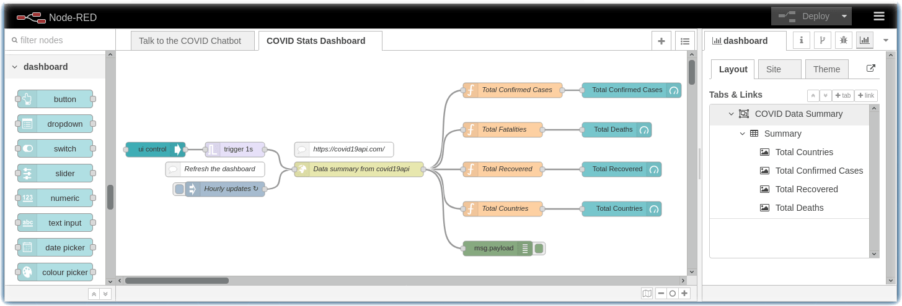

The **http request node** is using the public Covid-19 API https://api.covid19api.com/summary to retrieve the daily information for all countries with infections. 

Here's the sample JSON object from the summary API:

```json
{"Country":"US","Slug":"us","NewConfirmed":18058,"TotalConfirmed":83836,"NewDeaths":267,"TotalDeaths":1209,"NewRecovered":320,"TotalRecovered":681},
```

Each **function node** then aggregates the Total Confirmed Cases, Total Fatalities, Total Recovered, and Total Countries and sends the results to the corresponding **gauge node**.

This is the code in the **function node**

```javascript
let totalConfirmedCase = 0;

msg.payload.Countries.map(function(line){
    totalConfirmedCase += line.TotalConfirmed;
});

msg.payload = totalConfirmedCase;

return msg;
```

The above dashboard can be expanded to include daily new infections from [covid19api](https://api.covid19api.com/summary) data, charts, tables and chatbot UI.

## Build a Call for Code Crisis Communications solution!

Now that you have completed this tutorial, you are ready to modify these example flows and Node-RED Dashboard to build a [Call for Code COVID Crisis Communications](https://developer.ibm.com/callforcode/getstarted/covid-19/) solution.
